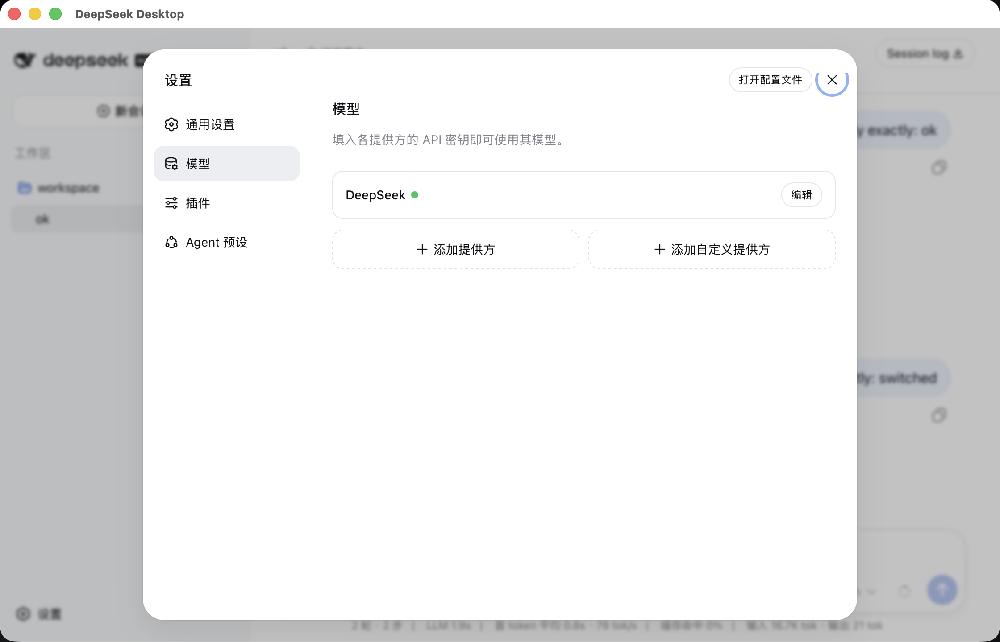
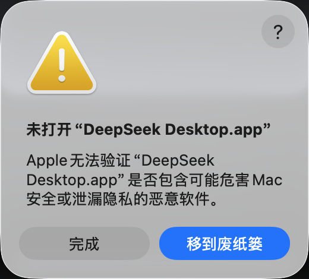
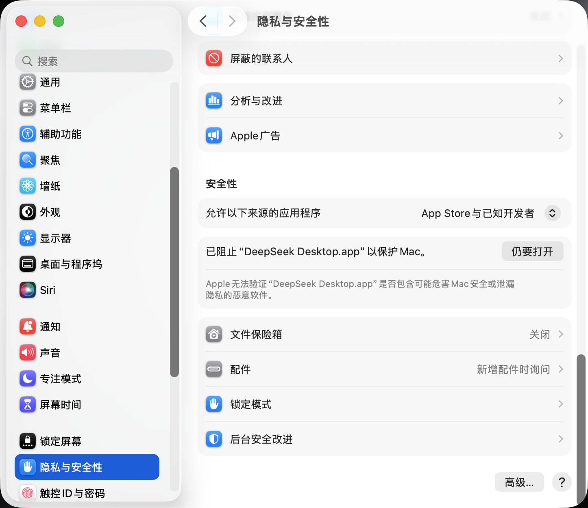

# DeepSeek Desktop

[](https://github.com/deepseek-desktop/deepseek-desktop/actions/workflows/community-build.yml)
[](LICENSE)

DeepSeek Desktop 是内置锁定版本本地 Runtime 的独立、非官方社区桌面应用。用户无需另外安装 Node.js、pnpm、Rust 或其他框架应用。本项目与 DeepSeek 不存在隶属、合作或官方背书关系。

源码默认和文档示例版本固定为 `1.0.0`，实际发行版本以 GitHub Releases 为准。macOS 安装包使用完整的 ad-hoc 签名，但没有 Apple Developer ID 身份和公证；Windows、Linux 社区版产物目前也没有可信发布者签名。桌面自有源码采用 Apache-2.0，内置 Runtime、Node.js 和 npm 依赖保留各自许可证声明。

安装包发布在 [GitHub Releases](https://github.com/deepseek-desktop/deepseek-desktop/releases)。安装前请使用同版本 `SHA256SUMS` 校验文件完整性。

## 界面预览





## 快速使用

1. 从 GitHub Releases 下载当前系统对应的安装包，完成安装后启动 DeepSeek Desktop。
2. 应用会自动启动本地 Runtime 并进入工作台，无需点击启动或预先选择目录；项目目录在工作台中按会话需要添加和切换。
3. 进入工作台的“设置 → 模型”，添加官方或自定义 Provider，填写 API 地址和密钥，并获取可用模型。
4. 在对话输入区切换模型，创建会话后即可进行对话、代码修改和项目文件操作。
5. 在“设置 → 插件”中打开 DSH Market，浏览、安装、更新或卸载插件；桌面版已内置所需包管理器。
6. 通过系统“视图”菜单在“工作台”和“桌面管理”之间切换。运行异常时可在“诊断”页分别导出脱敏日志或诊断包。

模型密钥会加密保存在本机，不进入日志、诊断包或浏览器存储。完整安装、配置和故障排查说明见[中文使用文档](docs/zh-CN/getting-started.md)。

联网搜索默认“跟随当前模型”：用户仍按原流程配置模型 Provider，不需要选择联网搜索协议或重复输入搜索密钥。Runtime 会根据当前会话模型的 API 协议自动匹配标准搜索协议，并复用该 Provider 已保存的地址、模型和凭据引用；切换模型后，下一次搜索立即跟随新的 Provider。无法可靠识别的非标准接口会明确提示，不会盲目试探协议或把密钥发送到其他服务。协议映射与扩展方式见[跟随当前模型的联网搜索](docs/zh-CN/runtime-web-search.md)。

### macOS 提示“Apple 无法验证”怎么办

当前社区版尚未使用 Apple Developer ID 签名和公证，因此首次打开时，macOS 可能提示“Apple 无法验证 DeepSeek Desktop 是否包含可能危害 Mac 安全或泄漏隐私的恶意软件”。该提示本身不代表应用已被检测出恶意代码。请只从本项目的 [GitHub Releases](https://github.com/deepseek-desktop/deepseek-desktop/releases) 下载，并核对同版本 `SHA256SUMS`。

**普通用户：**

1. 将 `DeepSeek Desktop.app` 拖入“应用程序”目录，然后尝试启动。
2. 如果出现下图所示提示，请先确认安装包来自本项目 GitHub Releases，并已核对 `SHA256SUMS`。确认无误后点击“完成”，**不要点击“移到废纸篓”**。

<p align="center">
  
</p>

3. 打开“系统设置 → 隐私与安全”，向下滚动到“安全性”区域。找到“已阻止 DeepSeek Desktop.app 以保护 Mac”，点击右侧的“仍要打开”。

<p align="center">
  
</p>

4. 按系统提示使用登录密码或 Touch ID 完成验证；如果随后再次出现确认框，请选择“打开”。这项确认通常只需完成一次，之后可从“应用程序”目录正常双击启动。

如果“仍要打开”没有出现，请重新启动一次 DeepSeek Desktop 触发拦截，再立即返回“系统设置 → 隐私与安全”查看。较旧版本的 macOS 可在“系统偏好设置 → 安全性与隐私 → 通用”中找到同类入口。

**开发者：** 确认安装包来源和 SHA-256 无误后，按以下两步操作。

1. 仅移除 DeepSeek Desktop 的下载隔离标记：

```bash
xattr -dr com.apple.quarantine "/Applications/DeepSeek Desktop.app"
```

2. 启动 DeepSeek Desktop：

```bash
open "/Applications/DeepSeek Desktop.app"
```

不要关闭 macOS 的全局 Gatekeeper、SIP 或 XProtect，也不要对“下载”目录批量移除隔离标记；这些操作会降低整台 Mac 的安全性。

## 架构

```text
Vue 桌面 Shell
  -> 单一原生窗口与隔离工作台 WebView
  -> 类型化 Tauri 命令与脱敏 Runtime 事件
Rust Runtime 管理器
  -> 对应平台的 Node sidecar
  -> 构建时锁定版本的 Runtime 生产依赖闭包
  -> 应用数据目录中的独立运行目录
  -> http://127.0.0.1:<随机端口>
桌面 CredentialProvider
  -> 短期会话 + stdin/stdout JSON
  -> 桌面 helper
  -> 本地加密凭据库
```

桌面端只创建一个操作系统窗口。Runtime 就绪后，工作台会在隔离子 WebView 中占满内容区，不保留重复工具栏。Desktop 只负责 Runtime 生命周期、更新、凭据和原生窗口，不保存或注册用户项目目录；项目目录由 Runtime 工作台自己的会话和工作区能力管理。Runtime 从应用数据目录内的独立运行目录启动，避免把 Desktop 壳的路径语义传给 Runtime。原生“视图”菜单可在“工作台”（`Cmd/Ctrl+1`）和“桌面管理”（`Cmd/Ctrl+2`）之间切换；设置、诊断、更新和 Runtime 恢复均在原窗口完成。应用退出时会保存窗口位置、尺寸和全屏状态；下次启动优先恢复到上次使用的显示器，原显示器已断开时自动回到当前可见显示器。

工作台 WebView 不获得 Tauri shell、文件系统或通用 IPC 权限，只能访问受管回环 Origin。每次 Runtime 启动都会生成短期凭据会话，真实 token 仅通过标准输入交付，应用数据目录只保存 SHA-256 授权摘要。Runtime 启动后会移除 Helper 相关环境变量，避免普通工具子进程继承短期会话。macOS、Windows 和 Linux 使用同一套 XChaCha20-Poly1305 加密凭据库，并采用原子替换、跨进程锁和私有 Unix 文件权限；不会降级写入 `.env`、YAML、浏览器存储或明文凭据文件。凭据库以当前操作系统用户为信任边界，不能防御已取得同一用户文件权限的恶意程序或 Agent 工具。

## 工具链

- Node.js `24.20.0`
- pnpm `11.24.0`
- Rust `1.98.0`
- Tauri CLI `2.11.4`
- 本地开发默认选择 Harness 仓库最新的 SemVer 标签；社区版和正式发布只接受仓库内经过审计的固定提交

`scripts/with-rust.mjs` 会把 Rust 安装到仓库的 `target/deepseek-desktop-toolchain/`，下载时校验 Rust 官方发布的 `rustup-init` SHA-256，并确认实际 `rustc` 版本与 lock 一致，不会修改用户的全局 Rust 环境。

## 本地开发

```bash
git clone git@github.com:deepseek-desktop/deepseek-desktop.git
cd deepseek-desktop
corepack pnpm@11.24.0 install --frozen-lockfile
corepack pnpm@11.24.0 app:sync
corepack pnpm@11.24.0 runtime:sync
corepack pnpm@11.24.0 verify
corepack pnpm@11.24.0 test:e2e
corepack pnpm@11.24.0 runtime:smoke
corepack pnpm@11.24.0 tauri:dev
```

`runtime/toolchain-lock.json` 固定 Node、Rust、原生依赖、桌面补丁和发布允许的 Runtime 来源。`RUNTIME_REF` 留空时，本地 `runtime:sync` 自动选择仓库中最新的 SemVer 版本标签；显式填写时则使用指定 tag、commit 或开发分支。两种方式都会解析并锁定不可变 commit，并把请求 ref、最终 ref、commit、动态 CLI 入口和 Runtime 哈希写入不提交 Git 的 `target/generated/runtime-lock.json`。社区版和正式发布额外要求解析结果匹配 `runtime/toolchain-lock.json` 中经过审计的固定仓库与提交；上游出现新版本时必须先复核并更新固定来源，不能在无人审查时自动改变安装包内容。Runtime staging 只消费该生成 lock，并且只保留当前原生目标。

staging 会下载目标平台的 Node.js 官方归档到仓库 `target/` 缓存，校验固定 SHA-256，移除安装期时间元数据和非目标平台原生制品，并输出确定性的 `runtime-manifest.json`、`licenses.json` 与 `sbom.spdx.json`。各平台允许使用的 `node-pty` 和 Koffi 原生制品固定在 `runtime/toolchain-lock.json`。

发布稳定性验证可设置 `DEEPSEEK_DESKTOP_SMOKE_CYCLES=100` 后执行 `runtime:smoke`。`DEEPSEEK_DESKTOP_DATA_DIR` 只用于隔离验收数据；正式用户无需配置，应用会自动使用 Tauri 对应平台的数据目录。

桌面 Shell 支持 `zh-CN`、`zh-TW` 和 `en-US`。当前 Runtime 的工作台界面只提供 `zh` 和 `en`，启动桥会把两种中文桌面语言映射到上游中文，把英文映射到上游英文，并原子更新 `dsh/settings.yaml`，不覆盖其他设置或注释。

## 一键打包

在仓库根目录执行：

```bash
corepack pnpm@11.24.0 package:community
```

该命令会安装固定依赖及锁定版本所需的 Chromium Headless Shell，执行应用配置与 Runtime 同步、社区版发布门禁、单元测试、端到端测试、Runtime 校验和 smoke，并构建当前操作系统与架构的安装包。最终文件写入 `release/<version>/<target>/`，同时生成目标平台对应的内部 `BUILD-INFO.<target>.json` 和 `SHA256SUMS`。打包结束前还会扫描实际交付闭包，阻断 `.env`、本机绝对路径、真实凭据、私钥及逃逸符号链接。macOS 安装包由 Tauri 生成 `.app` 后直接通过 `hdiutil` 创建，不依赖 Finder 或 AppleScript。

制作不要求干净 Git 工作区的本地定制包时使用：

```bash
corepack pnpm@11.24.0 desktop:package
```

可复制 `.env.example` 为 `.env` 来定制应用元数据和 Runtime 来源。配置优先级为“命令行环境变量 > `.env` > 内置默认值”；`.env` 不会进入 Runtime、安装包、诊断包或发布目录。`RUNTIME_REF` 默认留空，本地开发会自动选择最新版本标签；社区版和正式发布仍受仓库内固定 Runtime 来源约束。`DESKTOP_APP_REPOSITORY` 默认留空：GitHub Actions 使用当前工作流仓库地址，本地开发读取公开的 Git `origin`；若 `origin` 只是本机路径，则继续读取 `package.json` 或项目内置仓库地址。作者和仓库地址会显示在关于页，仓库地址可直接用系统浏览器打开。

## Runtime 独立更新

DeepSeek Desktop 将桌面外壳与 Harness Runtime 分开更新。安装包内始终保留一份经过构建验证的 Runtime；可信更新服务可另外发布 macOS arm64、macOS x64、Windows x64 和 Linux x64 的原生 Runtime 生产闭包。用户机器只下载当前平台的压缩制品，不拉取源码、不安装构建工具，也不在本机编译 Runtime。

“桌面管理 → 更新”提供三种方式：自动下载并在下次启动安装、发现后提醒、仅手动检查；默认使用“发现后提醒”，由用户确认后再下载，也可以固定当前 Runtime 或恢复安装包内置版本。Runtime 更新源默认使用安装包配置的官方源；高级用户也可以切换到自定义源，并一次性配置签名清单地址、Runtime 仓库身份、发布者和 Ed25519 公钥。切换来源会立即作废尚未下载的旧候选，不会把旧地址或旧公钥继续用于新来源。

候选版本只有在未过期且未重放的签名清单、发布者、仓库、平台、协议、桌面版本范围、Node ABI、凭据插件、DSH Market、大小和 SHA-256 全部匹配后才会进入 staging。下次启动会在隔离目录真实启动本地服务并完成 readiness 与认证 HTTP 探活，再原子切换；启动失败或运行恢复达到上限时自动回滚上一版，上一版不可用时回到安装包内置版。更新器只保留当前、上一版和待安装版本，并清理中断的 staging。更新目录只位于系统应用数据目录，不修改应用安装目录。

默认 `.env.example` 没有配置官方更新清单和公钥，因此不会连接任何 Runtime 更新服务；用户仍可在桌面管理中显式信任并配置完整的自定义更新源档案。发行维护者通过 `RUNTIME_UPDATE_MANIFEST_URL`、`RUNTIME_UPDATE_PUBLIC_KEY`、`RUNTIME_UPDATE_PUBLISHER` 和 `RUNTIME_REPOSITORY` 固化官方档案；其中 `RUNTIME_REPOSITORY` 只表示构建来源和清单中的仓库身份，客户端不会据此拉源码或编译。显式设置 `RUNTIME_REF` 的开发构建默认关闭自动下载，避免联调版本被替换。清单可放在 filesystem/NAS、普通 HTTPS 静态站点、GitHub、GitLab、Gitee、Gitea 或自建服务，不依赖 GitHub Release API。完整用户行为、安全边界、清单格式和发布命令见 [Runtime 独立更新指南](docs/zh-CN/runtime-updates.md)。

单台主机只构建其原生目标。默认和示例版本始终使用 `1.0.0`。符合 SemVer 的标签都会触发 GitHub Actions，可带或不带 `v` 前缀，例如 `1.0.0`、`v1.0.0`、`v0.1.0-community.13`；完整 SemVer 校验会在构建开始时执行，非法标签不会进入发行。全部平台通过后统一发布 macOS arm64/x64、Windows x64 和 Linux x64 安装包。发布构建从标签注入真实版本，不需要修改源码中的默认或示例版本。

## 多平台发布

正式发布统一由 GitHub Actions 官方托管 Runner 原生构建，不要求维护者在一台电脑上准备虚拟机、Rosetta 或 Docker：

- Pull Request 和普通分支 push 不触发发布工作流，也不创建安装包或 Release。
- 只有带或不带 `v` 前缀的完整 SemVer Tag 才触发质量门禁和四平台矩阵，例如 `1.0.0`、`v1.0.0`、`v1.0.0-rc.1`。
- macOS ARM64、macOS x64、Windows x64、Linux x64 分别在对应官方 Runner 上调用同一个 `package:community`。
- 四个平台全部成功后才创建 GitHub Release；任何目标失败都不会发布不完整版本。
- Release 只公开两份 DMG、一个 EXE、一个 AppImage、一个 DEB 和统一 `SHA256SUMS`，内部 `BUILD-INFO` 不作为下载附件。

发布前在当前 macOS 开发机执行 `verify`、`test:e2e`、`runtime:smoke` 和当前平台 `desktop:package`；正式 Tag 矩阵再使用 `package:community`。其他平台的构建与验收结论以对应 GitHub 原生 Runner 为准，不用本机模拟结果代替。完整维护流程见[多平台发布指南](docs/zh-CN/distributed-release.md)。

## 发布边界

当前社区版没有安装包可信发布者身份，因此桌面应用安装包自动更新保持关闭。Runtime 独立更新是另一条边界：只有构建时明确配置可信 Ed25519 清单与发布者的发行版才会启用，未配置时不联网检查。macOS 产物只有 ad-hoc Bundle 签名，没有 Apple Developer ID 签名和公证。未来 Stable 桌面版本必须通过 `pnpm release:check stable`，提供 Updater、Apple 和 Windows 签名材料，并完成对应平台的干净系统安装验收。

GitHub Actions 原生矩阵构建 macOS arm64/x64、Windows x64 和 Linux x64 产物。macOS arm64 与 Windows x64 还必须完成真实安装、启动、正常退出、孤儿进程、卸载和重装验收；某个平台构建成功不代表其他平台已经完成安装验收。

应用鱼形标识沿用固定上游 Runtime 提交中的侧边栏几何与主墨色，仅用于识别内置 Runtime，不代表官方发行或品牌授权。

更完整的安装、模型配置、数据目录、安全和故障排查说明见 [中文使用文档](docs/zh-CN/getting-started.md)。
