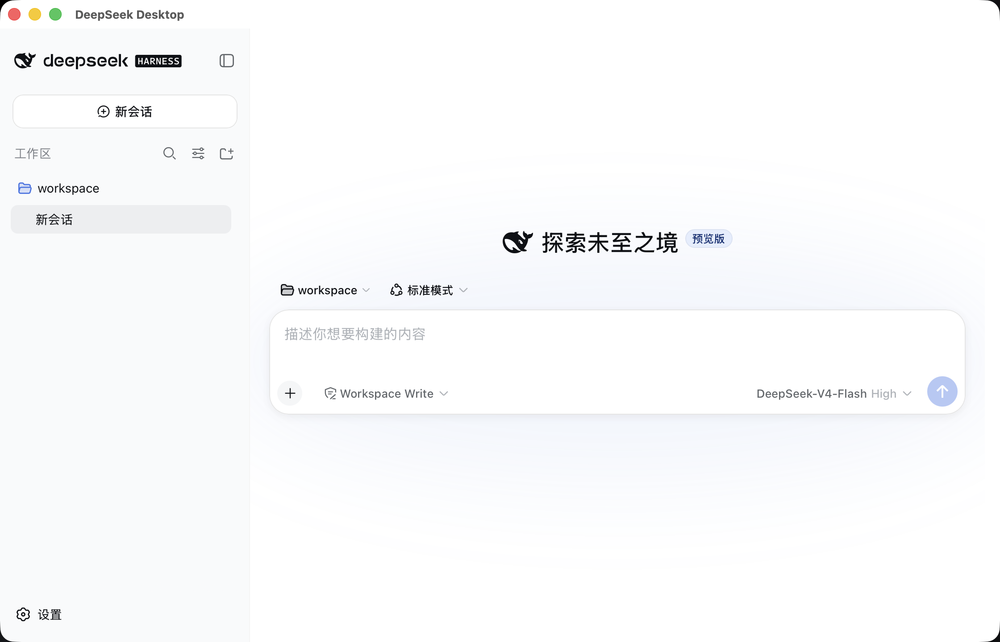
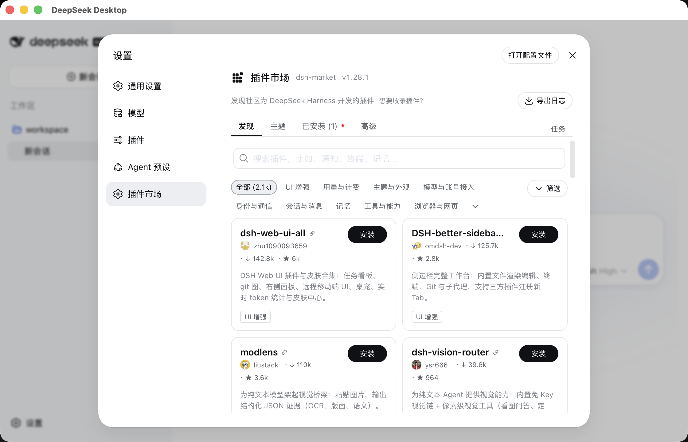

# DeepSeek Desktop

[](https://github.com/deepseek-desktop/deepseek-desktop/actions/workflows/community-build.yml)
[](LICENSE)

DeepSeek Desktop 是内置固定版本本地 Runtime 的独立、非官方社区桌面应用。用户无需另外安装 Node.js、pnpm、Rust 或其他框架应用。本项目与 DeepSeek 不存在隶属、合作或官方背书关系。

当前版本为 `0.1.0-community.7`。macOS 安装包使用完整的 ad-hoc 签名，但没有 Apple Developer ID 身份和公证；Windows、Linux 社区版产物目前也没有可信发布者签名。桌面自有源码采用 Apache-2.0，内置 Runtime、Node.js 和 npm 依赖保留各自许可证声明。

安装包发布在 [GitHub Releases](https://github.com/deepseek-desktop/deepseek-desktop/releases)。安装前请使用同版本 `SHA256SUMS` 校验文件完整性。

## 界面预览





## 快速使用

1. 从 GitHub Releases 下载当前系统对应的安装包，完成安装后启动 DeepSeek Desktop。
2. 首次使用时选择工作区。Agent 的文件读写和命令执行均以该目录为边界。
3. 进入工作台的“设置 → 模型”，添加官方或自定义 Provider，填写 API 地址和密钥，并获取可用模型。
4. 在对话输入区切换模型，创建会话后即可进行对话、代码修改和工作区文件操作。
5. 在“设置 → 插件”中打开 DSH Market，浏览、安装、更新或卸载插件；桌面版已内置所需包管理器。
6. 通过系统“视图”菜单在“工作台”和“桌面管理”之间切换。运行异常时可在“诊断”页分别导出脱敏日志或诊断包。

模型密钥会加密保存在本机，不进入日志、诊断包或浏览器存储。完整安装、配置和故障排查说明见[中文使用文档](docs/zh-CN/getting-started.md)。

## 架构

```text
Vue 桌面 Shell
  -> 单一原生窗口与隔离工作台 WebView
  -> 类型化 Tauri 命令与脱敏 Runtime 事件
Rust Runtime 管理器
  -> 对应平台的 Node sidecar
  -> 固定版本 Runtime 生产依赖闭包
  -> http://127.0.0.1:<随机端口>
桌面 CredentialProvider
  -> 短期会话 + stdin/stdout JSON
  -> 桌面 helper
  -> 本地加密凭据库
```

桌面端只创建一个操作系统窗口。Runtime 就绪后，工作台会在隔离子 WebView 中占满内容区，不保留重复工具栏。原生“视图”菜单可在“工作台”（`Cmd/Ctrl+1`）和“桌面管理”（`Cmd/Ctrl+2`）之间切换；设置、诊断、更新和 Runtime 恢复均在原窗口完成。

工作台 WebView 不获得 Tauri shell、文件系统或通用 IPC 权限，只能访问受管回环 Origin。每次 Runtime 启动都会生成短期凭据会话，真实 token 仅通过标准输入交付，应用数据目录只保存 SHA-256 授权摘要。macOS、Windows 和 Linux 使用同一套 XChaCha20-Poly1305 加密凭据库，并采用原子替换、跨进程锁和私有 Unix 文件权限；不会降级写入 `.env`、YAML、浏览器存储或明文凭据文件。

## 工具链

- Node.js `24.16.0`
- pnpm `11.7.0`
- Rust `1.98.0`
- Tauri CLI `2.11.4`
- 内置 Runtime `0.1.1-rc.2`，提交 `b150a551b8d465e31e418e1b2eaf5e79bbb7d28e`

`scripts/with-rust.mjs` 会把 Rust 安装到仓库的 `target/deepseek-desktop-toolchain/`，不会修改用户的全局 Rust 环境。

## 本地开发

```bash
git clone git@github.com:deepseek-desktop/deepseek-desktop.git
cd deepseek-desktop
corepack pnpm@11.7.0 install --frozen-lockfile
corepack pnpm@11.7.0 --dir runtime install --frozen-lockfile
corepack pnpm@11.7.0 verify
corepack pnpm@11.7.0 test:e2e
corepack pnpm@11.7.0 runtime:smoke
corepack pnpm@11.7.0 tauri:dev
```

`runtime/runtime-lock.json` 是上游制品的唯一版本事实。Runtime staging 在当前目标平台生成，不提交到 Git。

staging 会下载目标平台的 Node.js 官方归档到仓库 `target/` 缓存，校验固定 SHA-256，移除安装期时间元数据和非目标平台原生制品，并输出确定性的 `runtime-manifest.json`、`licenses.json` 与 `sbom.spdx.json`。各平台允许使用的 `node-pty` 和 Koffi 原生制品也固定在 `runtime/runtime-lock.json`。

发布稳定性验证可设置 `DEEPSEEK_DESKTOP_SMOKE_CYCLES=100` 后执行 `runtime:smoke`。`DEEPSEEK_DESKTOP_DATA_DIR` 只用于隔离验收数据；正式用户无需配置，应用会自动使用 Tauri 对应平台的数据目录。

桌面 Shell 支持 `zh-CN`、`zh-TW` 和 `en-US`。当前固定 Runtime 的工作台界面只提供 `zh` 和 `en`，启动桥会把两种中文桌面语言映射到上游中文，把英文映射到上游英文，并原子更新 `dsh/settings.yaml`，不覆盖其他设置或注释。

## 一键打包

在仓库根目录执行：

```bash
corepack pnpm@11.7.0 package:community
```

该命令会安装固定依赖，执行社区版发布门禁、单元测试、端到端测试、Runtime 校验和 smoke，构建当前操作系统与架构的安装包，并在适用时校验 macOS 签名与 DMG。最终文件写入 `release/<version>/`，同时生成 `BUILD-INFO.json` 和 `SHA256SUMS`。

单台主机只构建其原生目标。匹配版本标签（例如 `v0.1.0-community.7`）会触发 GitHub Actions，全部通过后统一发布 macOS arm64/x64、Windows x64 和 Linux x64 安装包。

## 发布边界

当前社区版没有可信发布者身份，自动更新保持关闭。macOS 产物只有 ad-hoc Bundle 签名，没有 Apple Developer ID 签名和公证。未来 Stable 版本必须通过 `pnpm release:check stable`，提供 Updater、Apple 和 Windows 签名材料，并完成对应平台的干净系统安装验收。

CI 会构建 macOS arm64/x64、Windows x64 和 Linux x64 产物。macOS arm64 与 Windows x64 还必须完成真实安装、启动、正常退出、孤儿进程、卸载和重装验收；某个平台构建成功不代表其他平台已经完成安装验收。

应用鱼形标识沿用固定上游 Runtime 提交中的侧边栏几何与主墨色，仅用于识别内置 Runtime，不代表官方发行或品牌授权。

更完整的安装、模型配置、数据目录、安全和故障排查说明见 [中文使用文档](docs/zh-CN/getting-started.md)。
